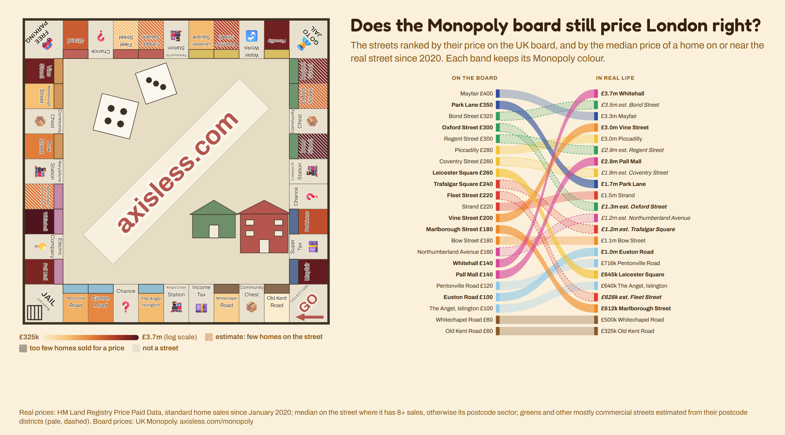
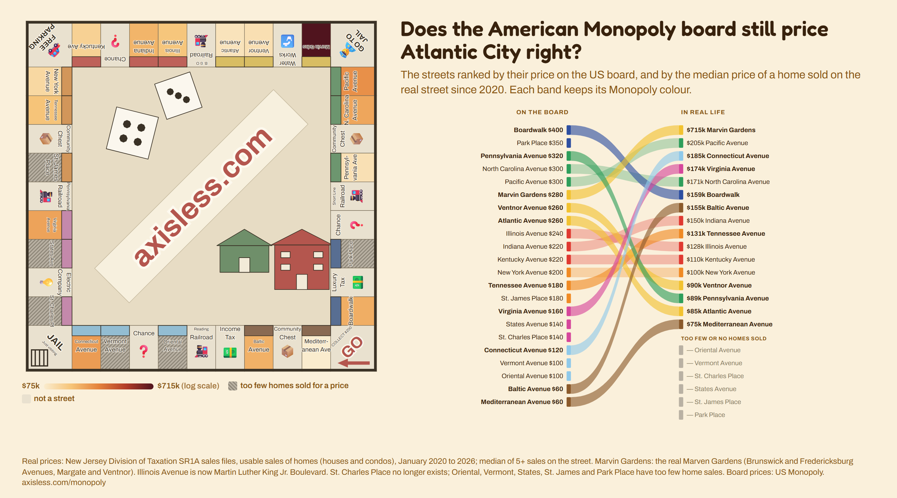
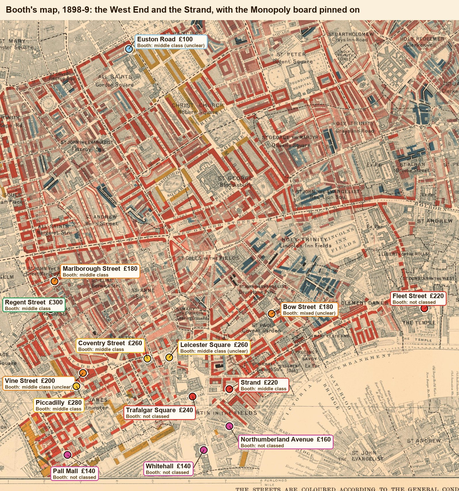

# Monopoly, priced for real

Does the Monopoly board still price its streets right? This repo prices every street on the **London** and the
original **Atlantic City** boards from real home sales, then asks whether the board was ever right, going back to
**London in 1898** and **Atlantic City in 1930**.

The story, with the interactive boards and a Monopoly guessing game: **[axisless.com/monopoly](https://axisless.com/monopoly/)**





## What it found

- **London today.** The board's order and real prices still broadly agree at the top: Mayfair and Park Lane are
  expensive. The middle has reshuffled: homes near Whitehall and Pall Mall have soared, Leicester Square and Marlborough
  Street have fallen. The greens (Regent, Oxford and Bond Street) are almost all shops, so they are estimated from
  the postcode districts around them.
- **London in 1995-97**, the first years of Land Registry records: the board matched real prices about as well then
  as now (rank correlation 0.62 then, 0.58 now).
- **London in 1898**, from Charles Booth's poverty map: only Mayfair and Park Lane were "wealthy". Old Kent Road and
  Whitechapel Road were busy shopping roads coloured middle class, with some of London's poorest streets behind them.
- **Atlantic City today.** Marvin Gardens (really Marven Gardens, in Margate and Ventnor) is the most expensive by far. The
  Boardwalk is mostly condos, and the yellows are among the cheapest.
- **Atlantic City in 1930**, five years before the game: the board barely matched rents even then. Only Boardwalk,
  at the top, was right.

## How it works

| Script | Does |
|---|---|
| `ingest/monopoly_prices.py` | Median price of homes sold on each London street since 2020, from the Land Registry's SPARQL endpoint; the street's postcode sector where the street has too few sales |
| `ingest/monopoly_page.py` | Estimates for streets with almost no homes (their postcode districts), and the same ladder for 1995-97; writes `site/monopoly/data.json` |
| `ingest/monopoly_us.py` | Atlantic City from New Jersey's SR1A sales files: usable home sales since 2020, street by street |
| `ingest/monopoly_us_1930.py` | Median monthly rent per street in 1930, from the IPUMS USA census samples (the only census files that keep street addresses) |
| `ingest/monopoly_booth.py` | Booth's 1898-9 map, read street by street, with a close-up of every reading |
| `ingest/monopoly_booth_annotate.py` | The annotated Booth maps below |

**Reading a 125-year-old map.** Booth coloured every street by the people who lived on it, in seven classes. We first
had a script match pixels to his printed key. Up close, the map is fine hatching, not flat colour, and the colours
drift from sheet to sheet, so the machine read the white road surface and counted the dark strokes of unclassed
buildings as "very poor". The readings are therefore done by eye, each one with a confidence, and every close-up is
in `site/monopoly/booth/` so you can check them.



## Run it

The results are all in `data/raw/` and `site/monopoly/data.json`; you only need the sources to rebuild them.

- **Land Registry**: queried live, nothing to download.
- **New Jersey sales**: download the yearly `Sales20xx.zip` files and `YTDSR1A2026.zip` from the
  [NJ Division of Taxation](https://www.nj.gov/treasury/taxation/lpt/statdata.shtml) into `downloads/njsales/`.
- **1930 census**: register (free) at [IPUMS USA](https://usa.ipums.org), make an extract of samples `us1930a` and
  `us1930b` with `CITY` = 0370 (Atlantic City), `STREET`, `VALUEH`, `RENT30`, `OWNERSHP`, and save the CSV as
  `downloads/ipums/usa_00002.csv.gz`. The microdata can't be shared here; only street totals are.
- **Booth's map**: the 12 sheets from [Charles Booth's London](https://booth.lse.ac.uk/learn-more/download-maps)
  into `downloads/booth/sheet1.jpg` ... `sheet12.jpg`.

```sh
pip install pillow
python ingest/monopoly_prices.py
python ingest/monopoly_us.py
python ingest/monopoly_us_1930.py
python ingest/monopoly_page.py
python ingest/monopoly_booth.py && python ingest/monopoly_booth_annotate.py
```

## Licences and sources

The code is MIT licensed (see `LICENSE`). The data keeps its sources' terms:

- **HM Land Registry Price Paid Data**: contains HM Land Registry data © Crown copyright and database right. Licensed
  under the [Open Government Licence v3.0](https://www.nationalarchives.gov.uk/doc/open-government-licence/version/3/).
- **Street locations** (`data/raw/monopoly-places.json`): geocoded with OpenStreetMap Nominatim, © OpenStreetMap
  contributors, [ODbL](https://opendatacommons.org/licenses/odbl/).
- **New Jersey SR1A sales**: public records, State of New Jersey, Division of Taxation.
- **1930 census**: Steven Ruggles, Sarah Flood, Matthew Sobek, Daniel Backman, Grace Cooper, Julia A. Rivera Drew,
  Stephanie Richards, Renae Rodgers, Jonathan Schroeder, and Kari C.W. Williams. IPUMS USA: Version 16.0 [dataset].
  Minneapolis, MN: IPUMS, 2025. https://doi.org/10.18128/D010.V16.0
- **Charles Booth's poverty map**: LSE Library, public domain.

Monopoly is a trademark of Hasbro. This is an independent project, not connected with or endorsed by Hasbro.

Made by [Paul Longe](https://github.com/PaulLonge) for [Axisless](https://axisless.com).
